# Homelab: AD-Integrated Proxmox Environment with IaC (Terraform) & Monitoring

A self-hosted lab that mirrors a small enterprise environment: a Windows Active Directory domain running on Proxmox, an observability stack (Prometheus/Grafana) monitoring the domain controller, and Terraform-based provisioning of new VMs.

---

## 1. Primary Infrastructure & Base VM Setup

**Primary Active Directory Domain Controller — `UW-DC01`**
- Role: Domain Controller
- IP Address: `10.0.0.10`

**Ubuntu Observability VM — `vm-observability`**
- Proxmox VM ID: `102`
- Specs: 2 vCPU, 2048 MB RAM, 40 GB Disk, VirtIO NIC on `vmbr0`
- OS: Ubuntu Server
- Networking (`/etc/netplan/00-installer-config.yaml`) — standard DHCP on `ens18`:

```yaml
network:
  version: 2
  ethernets:
    ens18:
      dhcp4: true
      dhcp6: true
      match:
        macaddress: bc:24:11:9b:68:4c
      set-name: ens18
```

### Building UW-DC01 on Proxmox

The domain controller VM (`Virtual Machine 100`, node `pve`) was built from a Windows Server ISO. During setup, the VirtIO SCSI driver had to be loaded manually so the installer could see the virtual disk:

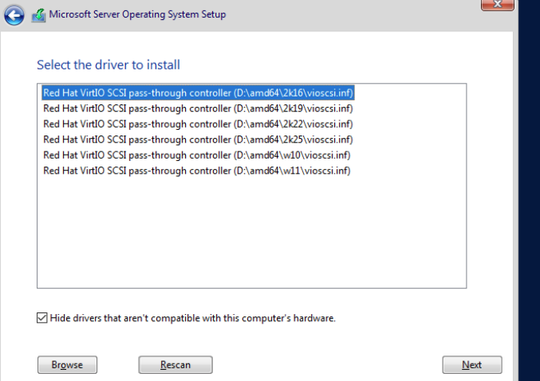
*Selecting the Red Hat VirtIO SCSI pass-through controller driver so the Windows Server installer can see the Proxmox virtual disk.*

After install, the VirtIO Ethernet adapter also needed its driver confirmed in Device Manager before networking would come up:

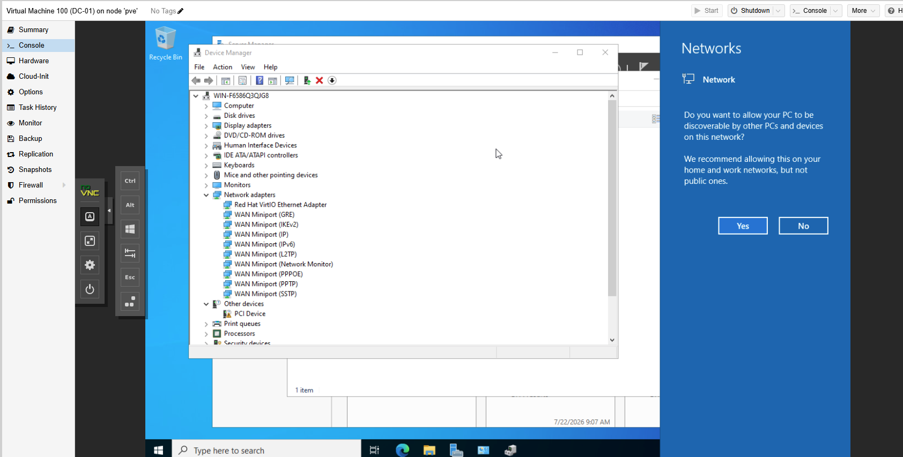
*Device Manager on DC-01 confirming the Red Hat VirtIO Ethernet Adapter is installed, with the network discoverability prompt in the background.*

Network Connections was still empty at this point (adapter not yet configured):

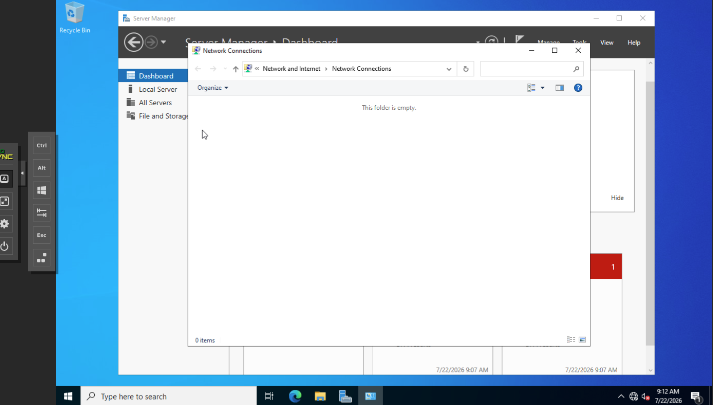
*Server Manager → Network Connections, before the NIC was configured with a static IP.*

### Docker & Docker Compose Environment (`vm-observability`)

```bash
# System update & dependency installation
sudo apt update && sudo apt upgrade -y
sudo apt install -y ca-certificates curl gnupg

# Add official Docker GPG key
sudo install -m 0755 -d /etc/apt/keyrings
sudo curl -fsSL https://download.docker.com/linux/ubuntu/gpg -o /etc/apt/keyrings/docker.asc
sudo chmod a+r /etc/apt/keyrings/docker.asc

# Add Docker repository to APT sources
echo \
  "deb [arch=$(dpkg --print-architecture) signed-by=/etc/apt/keyrings/docker.asc] https://download.docker.com/linux/ubuntu \
  $(. /etc/os-release && echo "$VERSION_CODENAME") stable" | \
  sudo tee /etc/apt/sources.list.d/docker.list > /dev/null

# Install Docker Engine, CLI, and Compose plugin
sudo apt update
sudo apt install -y docker-ce docker-ce-cli containerd.io docker-buildx-plugin docker-compose-plugin

# Add user to docker group for non-root execution
sudo usermod -aG docker $USER
newgrp docker
```

### Monitoring Stack Configuration

`~/monitoring/prometheus.yml`

```yaml
global:
  scrape_interval: 15s

scrape_configs:
  - job_name: 'prometheus'
    static_configs:
      - targets: ['localhost:9090']

  - job_name: 'UW-DC01'
    static_configs:
      - targets: ['10.0.0.10:9182']
```

`~/monitoring/docker-compose.yml`

```yaml
version: '3.8'

services:
  prometheus:
    image: prom/prometheus:latest
    container_name: prometheus
    restart: unless-stopped
    ports:
      - "9090:9090"
    volumes:
      - ./prometheus.yml:/etc/prometheus/prometheus.yml
      - prometheus_data:/prometheus

  grafana:
    image: grafana/grafana:latest
    container_name: grafana
    restart: unless-stopped
    ports:
      - "3000:3000"
    volumes:
      - grafana_data:/var/lib/grafana

volumes:
  prometheus_data:
  grafana_data:
```

Deployed with `docker compose up -d`.

### Agent Installation on Windows Server (`UW-DC01`)

```powershell
# Download windows_exporter MSI
Invoke-WebRequest -Uri "https://github.com/prometheus-community/windows_exporter/releases/download/v0.25.1/windows_exporter-0.25.1-amd64.msi" -OutFile "$env:TEMP\windows_exporter.msi"

# Install windows_exporter with Active Directory collectors enabled
Start-Process msiexec.exe -ArgumentList '/i', "$env:TEMP\windows_exporter.msi", '/qn', 'ENABLED_COLLECTORS=ad,cpu,cs,logical_disk,net,os,service,system', 'LISTEN_PORT=9182' -Wait

# Open Windows Firewall rule for metrics scraping
New-NetFirewallRule -DisplayName "Prometheus Windows Exporter" -Direction Inbound -Action Allow -Protocol TCP -LocalPort 9182
```

### Grafana Integration & Dashboard Setup

- Accessed Grafana UI at `http://<UBUNTU-IP>:3000` (default `admin` / `admin`)
- Configured Prometheus data source using the internal Docker URL `http://prometheus:9090`, verified via **Save & Test**
- Imported the pre-built Windows Exporter dashboard (ID `14510` / `10467`) against the Prometheus data source

---

## 2. Domain Joining & Mirroring UW Infrastructure

### Step 1 — Spin up a client VM in Proxmox (~10 min)

- **General:** Name `uw-workstation-01`, VM ID `103`
- **OS:** Windows 10/11 or Windows Server ISO
- **System:** Defaults (QEMU Guest Agent if installed)
- **Disks:** 40 GB on `local-lvm`
- **CPU:** 2 cores, type `host`
- **Memory:** 4096 MB
- **Network:** Bridge `vmbr0`, model VirtIO

### Step 2 — Configure primary DNS on the client (~2 min)

> Critical rule: AD domain joins fail if the client isn't pointed directly at an AD domain controller for DNS.

```powershell
Set-DnsClientServerAddress -InterfaceAlias "Ethernet" -ServerAddresses ("10.0.0.10")
Test-NetConnection -ComputerName 10.0.0.10 -Port 53   # expect TcpTestSucceeded : True
```

The same static-IP/DNS pattern was applied directly on DC-01 itself — setting `10.0.0.10` as its own address, gateway `10.0.0.1`, preferred DNS `127.0.0.1` (itself), alternate `10.0.0.1`:

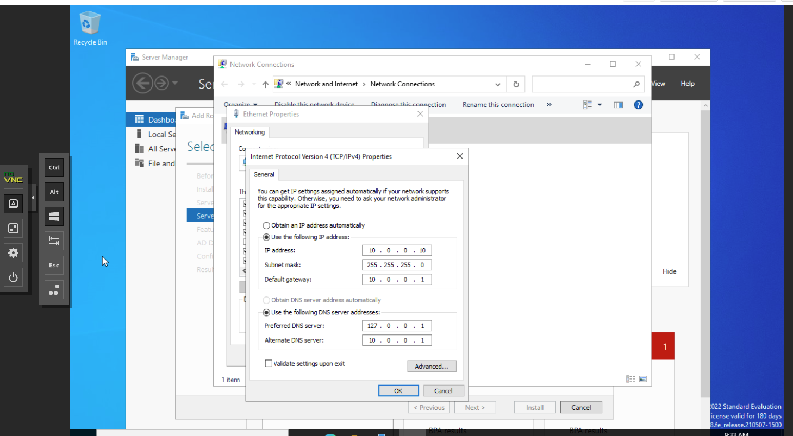
*Static IP configuration on DC-01: address `10.0.0.10`, gateway `10.0.0.1`, DNS pointed at itself (`127.0.0.1`) with `10.0.0.1` as the alternate — required before promoting the box to a domain controller.*

Attempting to add the AD DS role before a static IP was set threw the expected Server Manager validation warning:

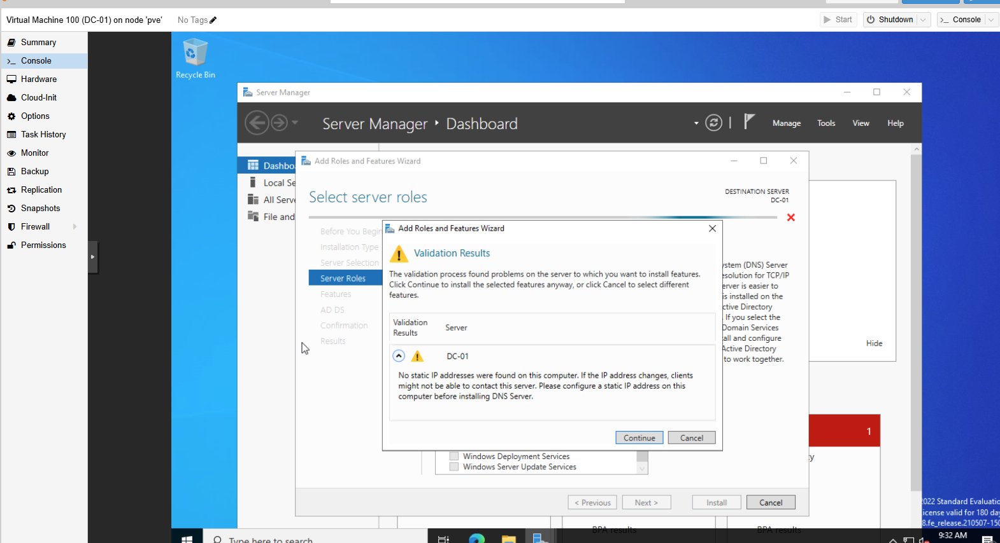
*Validation warning: "No static IP addresses were found on this computer" — confirms why the static IP had to be configured first.*

### Promoting DC-01 to a Domain Controller

With the static IP and role installed, the Active Directory Domain Services Configuration Wizard was used to stand up a brand-new forest:

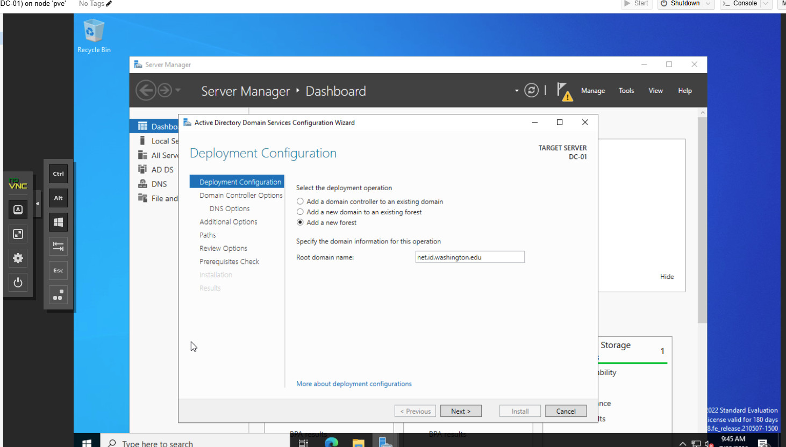
*Deployment Configuration step — "Add a new forest" with root domain name `net.id.washington.edu`.*

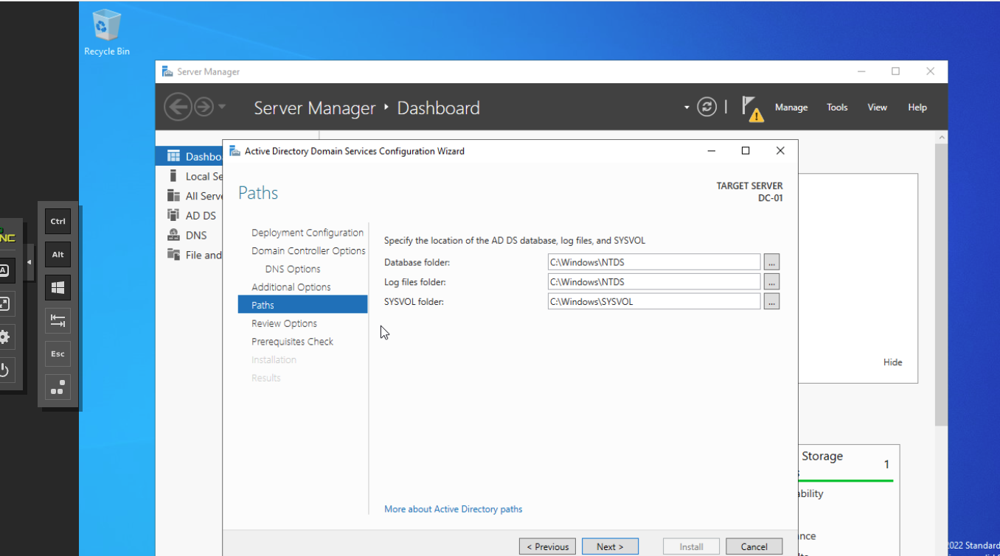
*Default paths for the AD DS database, log files, and SYSVOL folder.*

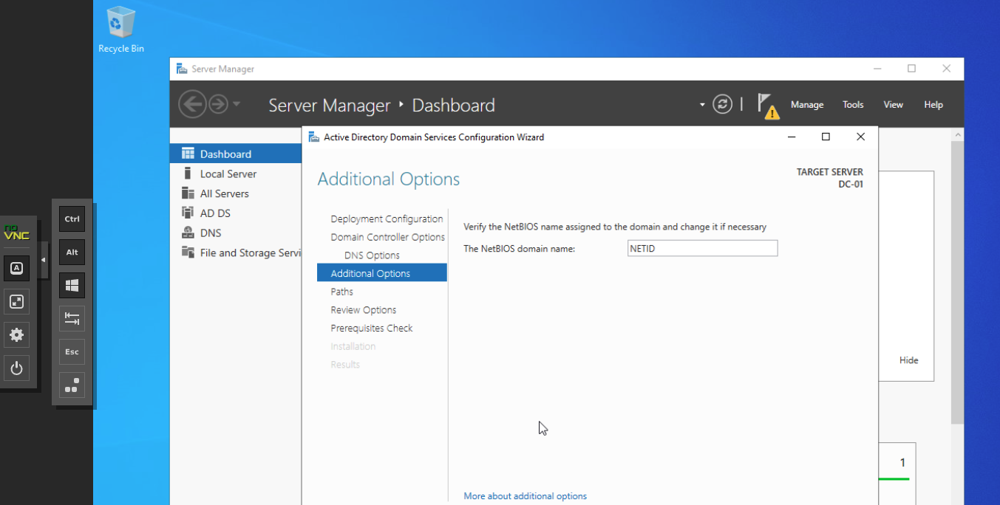
*NetBIOS domain name confirmed as `NETID`.*

After the promotion completed and the server rebooted, the logon screen now shows the domain account instead of a local one:

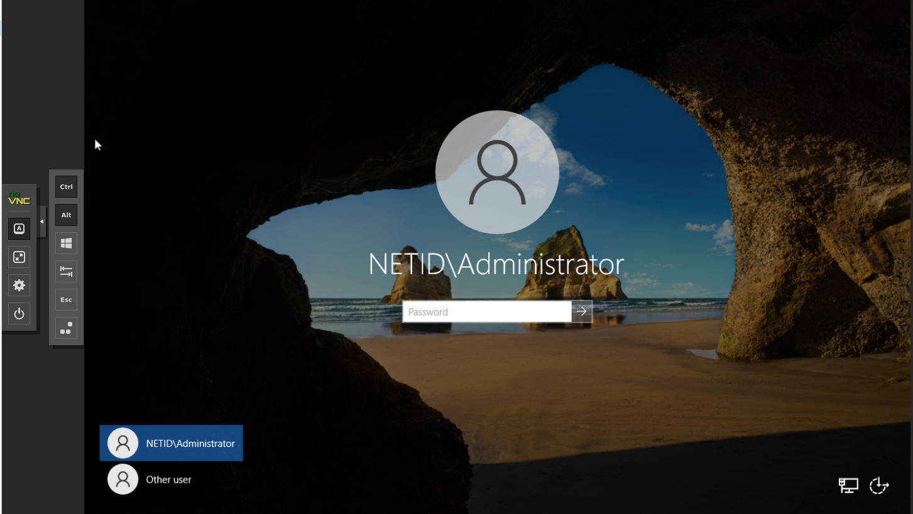
*Post-promotion reboot — the logon screen now authenticates as `NETID\Administrator`, confirming the forest and domain came up successfully.*

### Step 3 — Build the OU structure on UW-DC01 (~5 min)

Base structure created via `dsa.msc`: a root `UW-Lab` OU containing `Workstations`, `Servers`, and `Delegated`.

This was then extended with a delegated-admin model: department-specific OUs (`CAS IT`, `Biology`, `English`, `Psychology`, `HR`) nested under `Delegated`, giving each department its own management boundary:

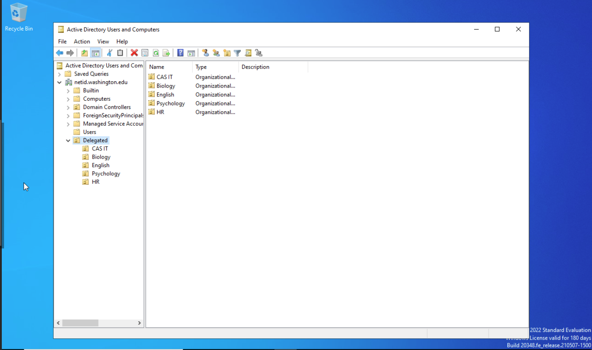
*`Delegated` OU broken out by department: CAS IT, Biology, English, Psychology, HR.*

OU creation was scripted with PowerShell rather than done by hand. First, a quick test OU under `CAS IT`:

```powershell
$DomainPath = "DC=netid,DC=washington,DC=edu"
New-ADOrganizationalUnit -Name "test" -Path "OU=CAS IT,OU=Delegated,DC=netid,DC=washington,DC=edu" -ProtectedFromAccidentalDeletion $true
```

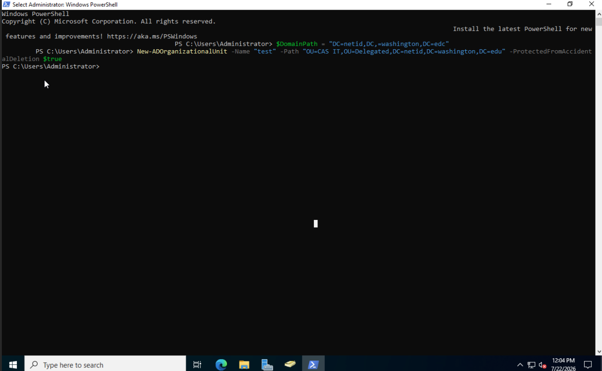
*Running `New-ADOrganizationalUnit` from PowerShell to create the `test` OU under `Delegated\CAS IT`.*

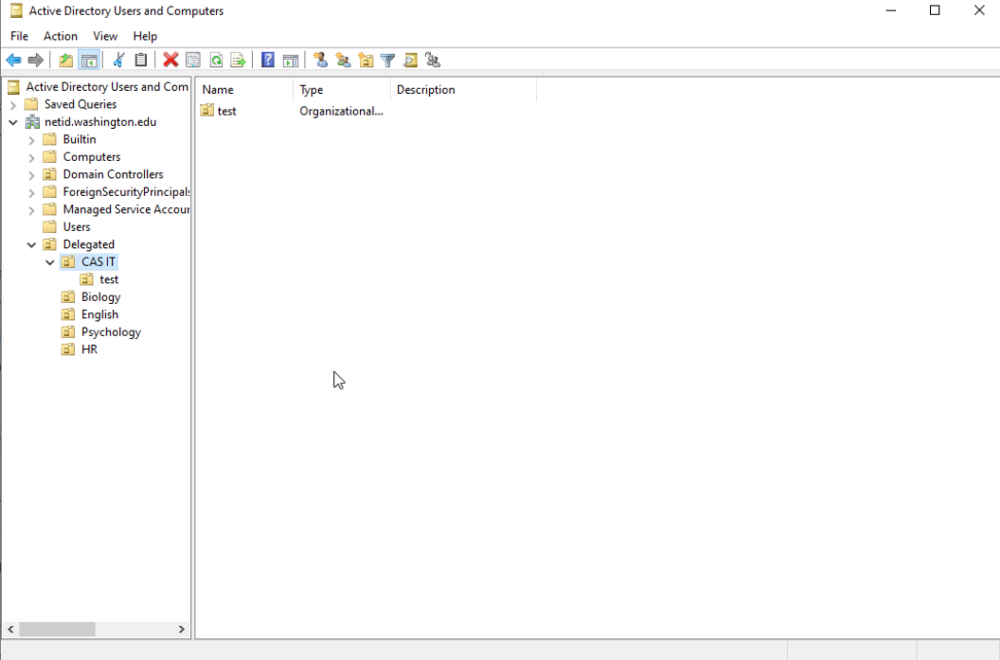
*Result confirmed in ADUC — the `test` OU now exists under `CAS IT`.*

Then a larger script built a `Workstations` OU under `CAS IT` and looped through a list of department names to create sub-OUs automatically:

```powershell
# 1. Define the path to the CAS IT OU
$CasITPath = "OU=CAS IT,OU=Delegated,DC=netid,DC=washington,DC=edu"

# 2. Create the "Workstations" OU inside CAS IT
New-ADOrganizationalUnit -Name "Workstations" -Path $CasITPath -ProtectedFromAccidentalDeletion $true

# 3. Define the path to the newly created Workstations OU
$WorkstationsPath = "OU=Workstations,$CasITPath"

# 4. List of Department OUs to create inside Workstations
$Departments = @(
    "Psychology",
    "DEC - Department of Economics",
    "DAC - Department of Awesomeness",
    "DME - Department of Mechanical Engineering"
)

# 5. Loop through and create each Department OU
foreach ($Dept in $Departments) {
    New-ADOrganizationalUnit -Name $Dept -Path $WorkstationsPath -ProtectedFromAccidentalDeletion $true
}

Write-Host "Workstations and Department OUs created successfully!" -ForegroundColor Green
```

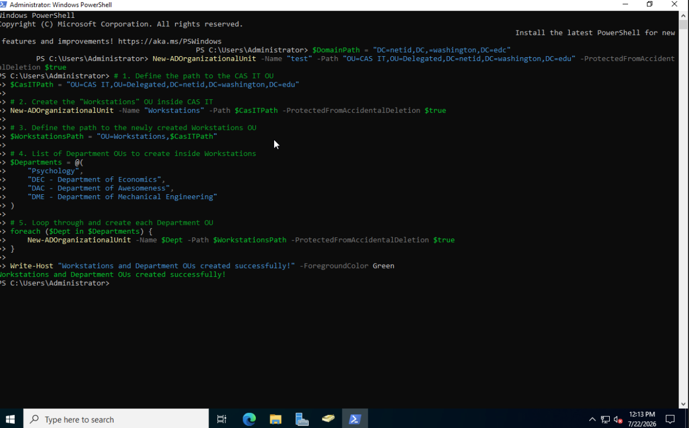
*Script output: `Workstations` OU created, then `DAC`, `DEC`, `DME`, and `Psychology` OUs created in a loop.*

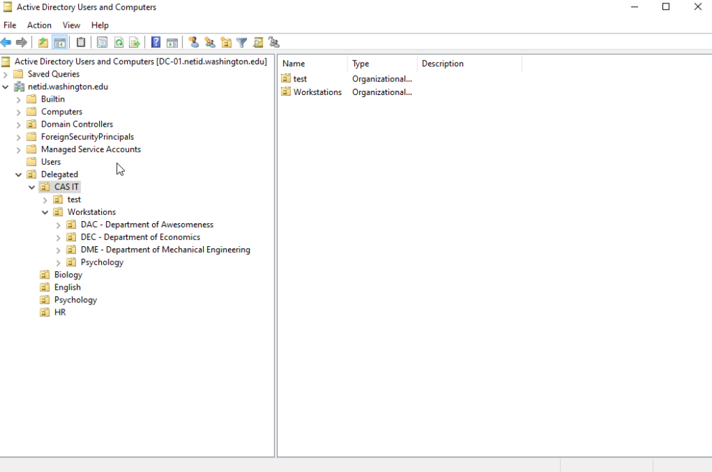
*Final OU tree under `CAS IT`: `Workstations` containing `DAC`, `DEC`, `DME`, and `Psychology`.*

To validate the delegated OU actually worked for object creation, a test user was added inside `Delegated\CAS IT`:

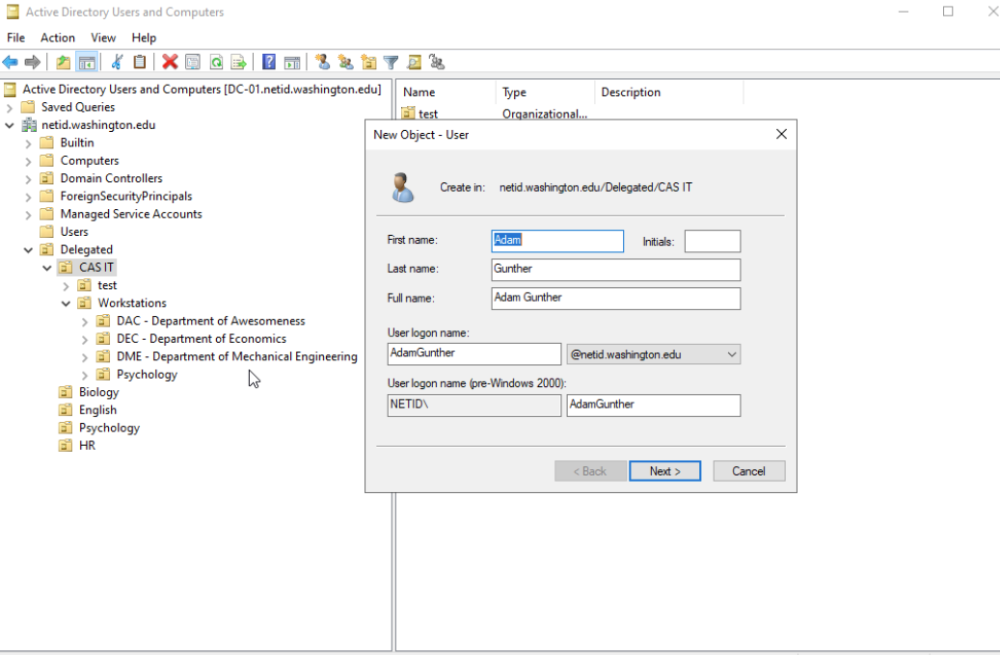
*Creating a test user, "Adam Gunther," directly inside the `CAS IT` OU to validate the delegation structure.*

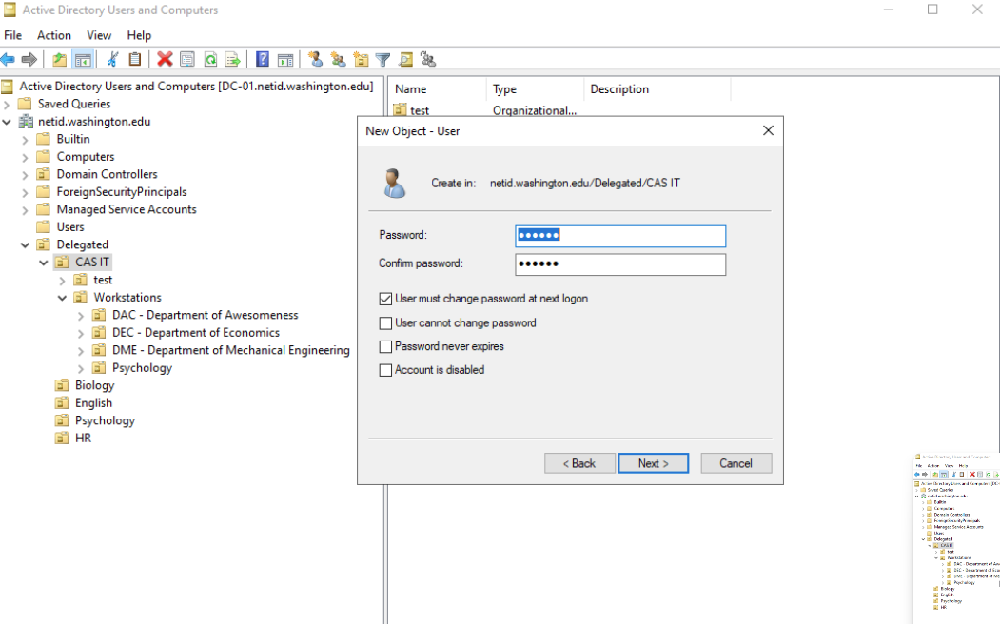
*Setting the initial password with "User must change password at next logon" enabled.*

The first password attempt didn't meet the domain's default complexity policy, which is a useful confirmation that Default Domain Policy password requirements were actually in effect:

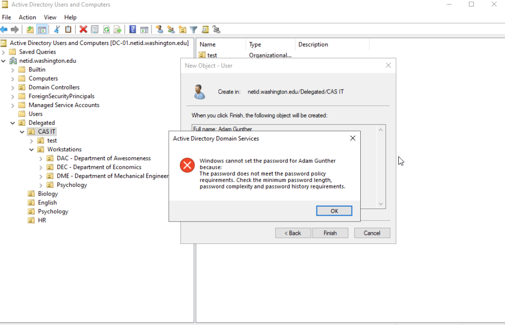
*Expected failure — the password didn't satisfy the domain's password complexity/length policy, proving the Default Domain Policy is enforced.*

A compliant password resolved it, and the user was created successfully:

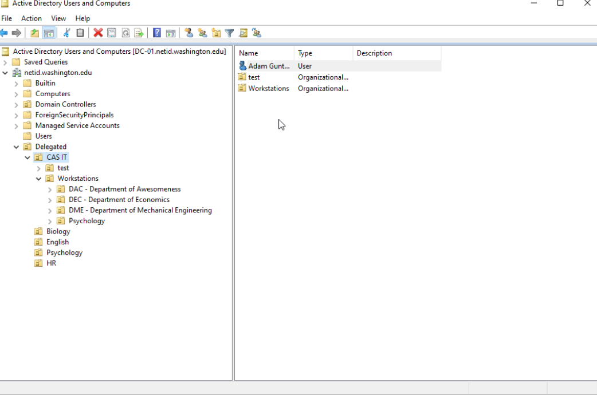
*User `Adam Gunther` now exists under `Delegated\CAS IT`, confirming both the OU delegation and password policy are working as intended.*

### Step 4 — Join the client VM to the domain (~3 min)

```powershell
Add-Computer -DomainName "YOUR_DOMAIN" -Restart
```

Enter Domain Administrator credentials when prompted; the machine joins and restarts automatically.

### Step 5 — Move the machine account & create a GPO (~5 min)

1. In `dsa.msc`, drag `uw-workstation-01` from the default `Computers` container into `UW-Lab → Workstations`.
2. In `gpmc.msc`, right-click the `Workstations` OU → **Create a GPO in this domain, and Link it here...** → name it `GPO-Workstation-Defaults`.
3. Edit the GPO: `Computer Configuration → Policies → Windows Settings → Security Settings → Local Policies → Security Options → Interactive logon: Message text for users attempting to log on` → set to `"Welcome to the UW Enterprise Lab Network"`.
4. On the client, force policy application:

```powershell
gpupdate /force
```

**Verification:** the custom logon banner appears at `Ctrl+Alt+Del` on `uw-workstation-01`, confirming Group Policy is driving client configuration end-to-end.

Before the GPO could be linked, the joined machine (`CAS-30200123`) still sat in the default `Computers` container and had to be relocated into the `UW-Lab` OU tree:

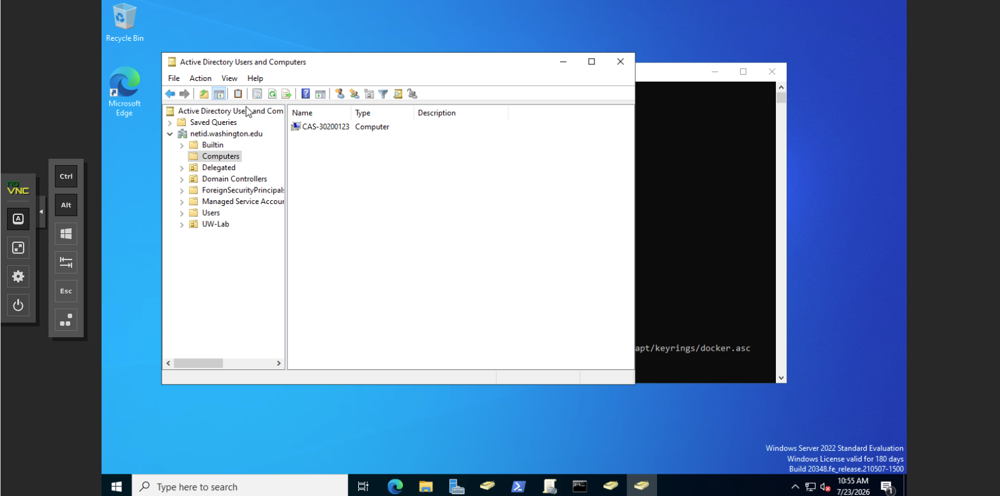
*The domain-joined machine `CAS-30200123` in the default `Computers` container, before being dragged into `UW-Lab → Workstations`.*

With the machine moved, a fresh GPO was created and linked directly to the `Workstations` OU:

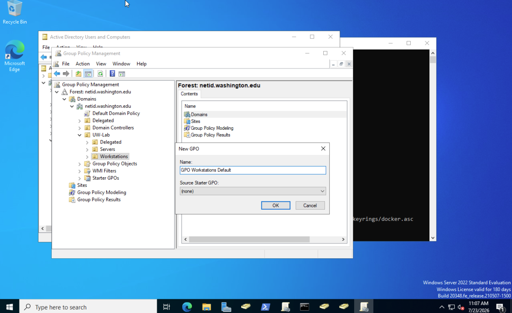
*Creating and linking `GPO Workstations Default` to the `Workstations` OU in Group Policy Management.*

The **Interactive logon: Message text** policy was defined first:

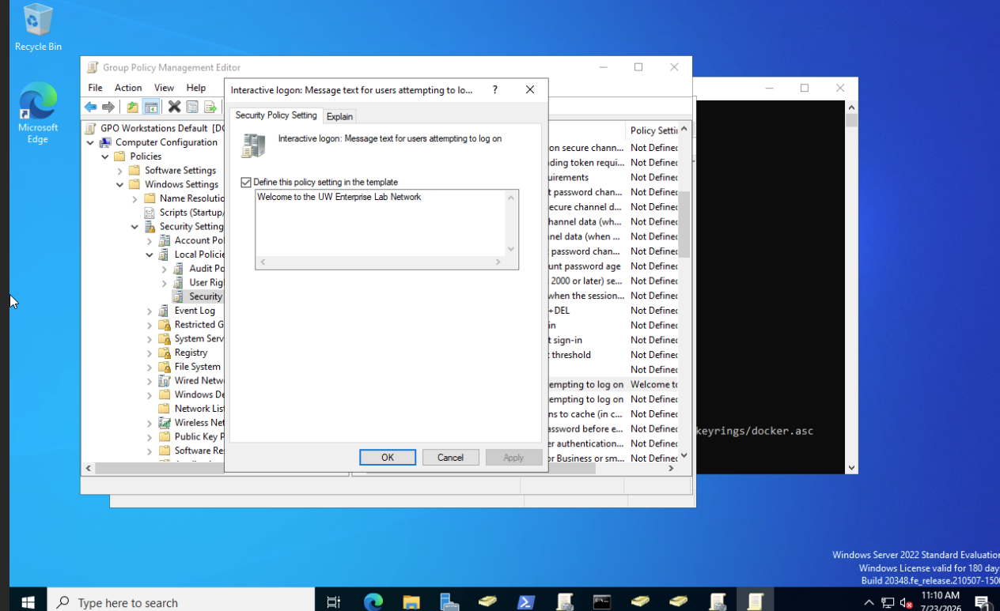
*`Interactive logon: Message text for users attempting to log on` set to "Welcome to the UW Enterprise Lab Network."*

A first `gpupdate /force` was run to pull the policy down early:

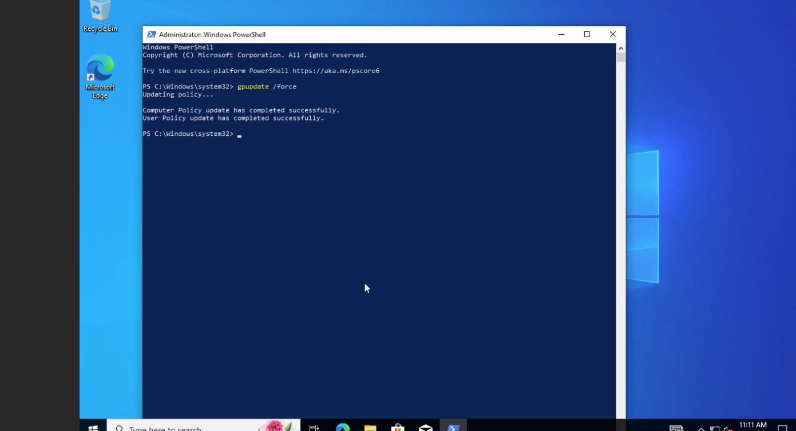
*`gpupdate /force` — both Computer Policy and User Policy update completed successfully.*

The message-text setting was then reopened to confirm it stuck:

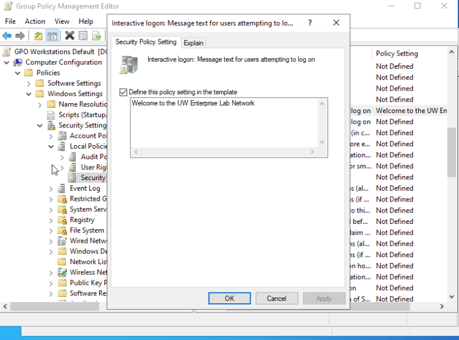
*Re-checking the message-text policy in the Group Policy Management Editor.*

A companion **Interactive logon: Message title** policy was added, since a logon banner needs both a title and body text to render as a proper dialog:

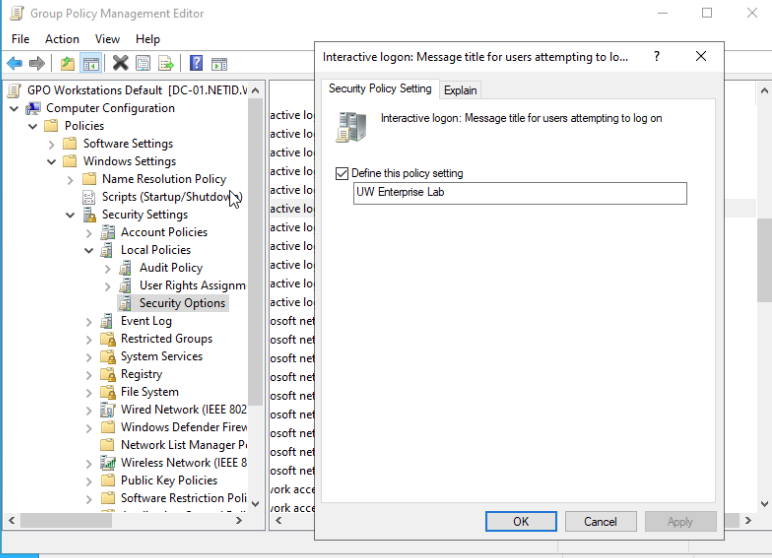
*`Interactive logon: Message title for users attempting to log on` set to "UW Enterprise Lab."*

With both settings applied and policy refreshed, the logon banner finally rendered as intended:

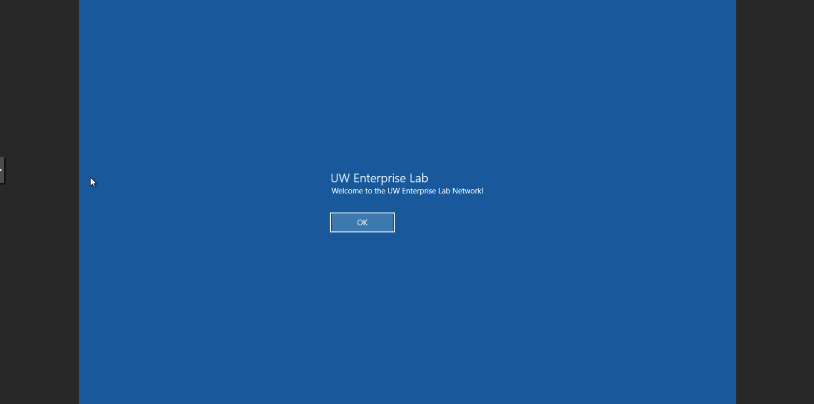
*End result: the `Ctrl+Alt+Del` logon screen on `uw-workstation-01` now shows the "UW Enterprise Lab" title with the "Welcome to the UW Enterprise Lab Network!" message — Group Policy confirmed working end-to-end.*

---

## 3. Git & Repository Setup (~10 min)

```bash
sudo apt update && sudo apt install -y git
git --version

git config --global user.name "Your Name"
git config --global user.email "your-email@example.com"

mkdir -p ~/homelab-infra/terraform
cd ~/homelab-infra
git init
```

`.gitignore` (critical: never commit API tokens, passwords, or state files with secrets):

```
# Terraform local state and secrets
*.tfstate
*.tfstate.*
*.tfvars
.terraform/
.terraform.lock.hcl

# Environment variables
.env
credentials.auto.tfvars

# OS files
.DS_Store
```

---

## 4. Proxmox + Terraform Integration

Provisioning Proxmox VMs automatically via API token using the `bpg/proxmox` provider, including bootable ISO media.

### Step 1 — Create a Proxmox API token (~5 min)

- Proxmox Web UI → **Datacenter → Permissions → API Tokens → Add**
- User: `root@pam`, Token ID: `terraform-token`
- Privilege Separation unchecked (lab-only — inherits root permissions)
- Copy the secret token immediately; Proxmox only shows it once

### Step 2 — Write the Terraform script (~5 min)

```bash
cd ~/homelab-infra/terraform

# Install Terraform
wget -O- https://apt.releases.hashicorp.com/gpg | sudo gpg --dearmor -o /usr/share/keyrings/hashicorp-archive-keyring.gpg
echo "deb [signed-by=/usr/share/keyrings/hashicorp-archive-keyring.gpg] https://apt.releases.hashicorp.com $(lsb_release -cs) main" | sudo tee /etc/apt/sources.list.d/hashicorp.list
sudo apt update && sudo apt install -y terraform
```

`main.tf`:

```hcl
terraform {
  required_providers {
    proxmox = {
      source  = "bpg/proxmox"
      version = "0.68.0"
    }
  }
}

provider "proxmox" {
  endpoint  = "https://10.0.0.234:8006/"
  api_token = "root@pam!terraform-token=<YOUR_SECRET_TOKEN_HERE>"
  insecure  = true
}

resource "proxmox_virtual_environment_vm" "test_server" {
  name      = "uw-tf-test-01"
  node_name = "pve"
  vm_id     = 104

  cpu {
    cores = 2
  }

  memory {
    dedicated = 2048
  }

  disk {
    datastore_id = "local"
    interface    = "scsi0"
    size         = 20
  }

  # Mounted Kali Linux ISO for OS installation
  cdrom {
    enabled   = true
    file_id   = "local:iso/kali-linux-2026.2-installer-amd64.iso"
    interface = "ide2"
  }

  network_device {
    bridge = "vmbr0"
  }
}
```

### Step 3 — Initialize, plan, and deploy (~5 min)

```bash
terraform init
terraform plan
terraform apply -auto-approve
```

### Step 4 — Lock configuration into version control

```bash
cd ~/homelab-infra
cat << 'EOF' > .gitignore
*.tfstate
*.tfstate.*
*.tfvars
.terraform/
.terraform.lock.hcl
EOF

git add terraform/main.tf .gitignore
git commit -m "feat(terraform): provision test VM 104 with Kali ISO via bpg/proxmox provider"
```

**Verification:** the Proxmox console for VM 104 (`uw-tf-test-01`) shows the Kali Linux installer boot screen, confirming Terraform successfully provisioned the VM end-to-end via the Proxmox API.

### Walkthrough: Git init → API token → `terraform apply` → first boot

Git identity and the `homelab-infra` repo were initialized directly on `vm-observability`:

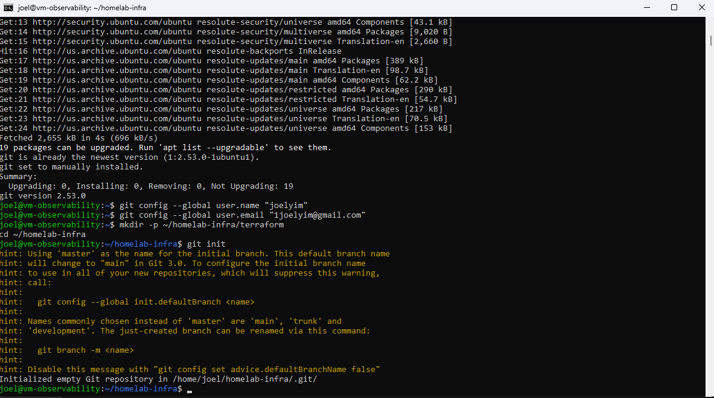
*Setting global git identity and running `git init` inside `~/homelab-infra` on `vm-observability`.*

The Proxmox API token was created exactly as documented — `root@pam`, Token ID `terraform-token`, Privilege Separation unchecked for lab use:

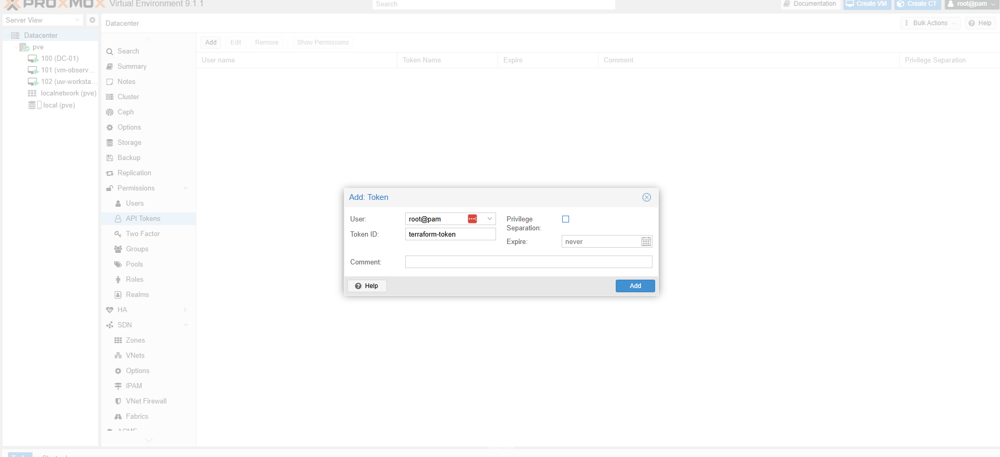
*Creating `terraform-token` under `root@pam` with Privilege Separation off, so it inherits root permissions for the lab.*

After writing `main.tf`, `terraform init` pulled down the `bpg/proxmox` provider and initialized the working directory cleanly:

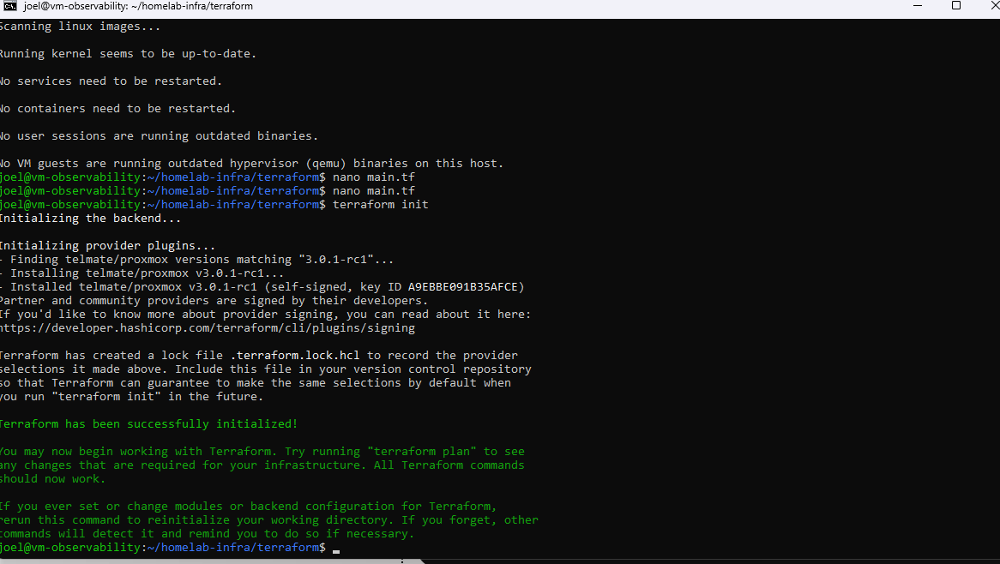
*`terraform init` — provider `telmate/proxmox` resolved and the backend initialized successfully.*

The token now shows up in the Proxmox UI under **Datacenter → Permissions → API Tokens**:

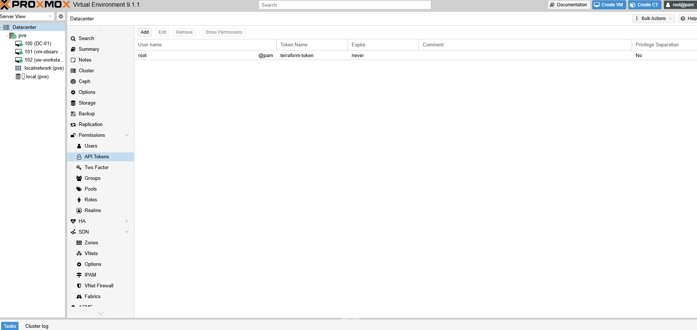
*Confirmed in the UI: `root@pam` / `terraform-token`, no expiry, Privilege Separation "No."*

A second token attempt was also tried with **Privilege Separation enabled**, to see how a scoped/least-privilege token would need to be set up instead of the wide-open root token:

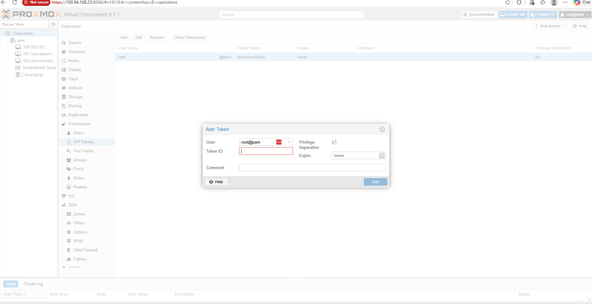
*Testing the Privilege Separation option — a separated token would need explicit role/permission assignment to be usable, unlike the unrestricted root token used for the lab.*

Before running `terraform apply`, the Proxmox sidebar still only showed the three manually built VMs (`100`, `101`, `102`):

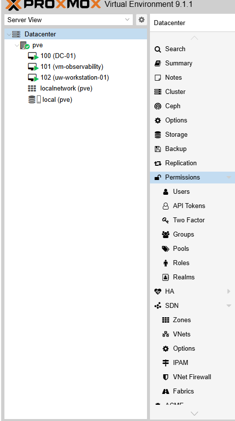
*Datacenter view just before `terraform apply` — no VM 104 yet.*

After `terraform apply -auto-approve`, VM `104 (uw-tf-test-01)` appeared automatically in the inventory — the first VM in this lab created entirely through code instead of the Proxmox UI:

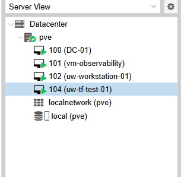
*Terraform-provisioned VM 104 (`uw-tf-test-01`) now listed alongside the manually built VMs.*

The first console boot, however, failed — the VM had no bootable disk image attached yet, so it fell through to a network (iPXE) boot attempt that also had nothing to fetch:

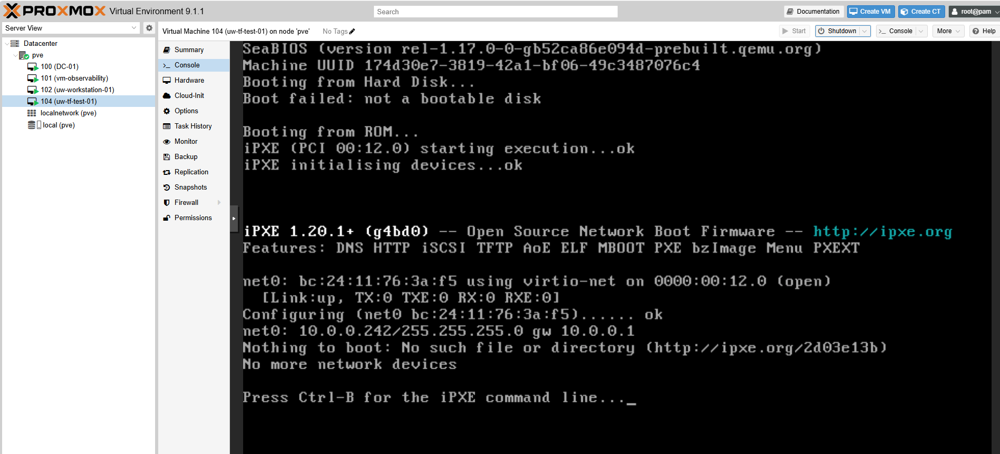
*`Boot failed: not a bootable disk` → falls back to iPXE, which also has nothing to boot from. Expected, since the initial `main.tf` disk was blank with no OS installer mounted yet.*

The fix was to make sure a real installer ISO existed in Proxmox local storage so the `cdrom` block in `main.tf` had something valid to reference — confirmed here with the Kali ISO freshly uploaded alongside the other images:

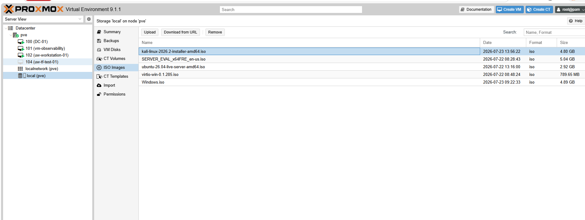
*`kali-linux-2026.2-installer-amd64.iso` uploaded to the `local` storage pool, matching the `file_id` referenced in `main.tf`'s `cdrom` block.*

With the ISO in place and the VM's `cdrom` correctly pointed at it, the console booted straight into the Kali installer on the next attempt:

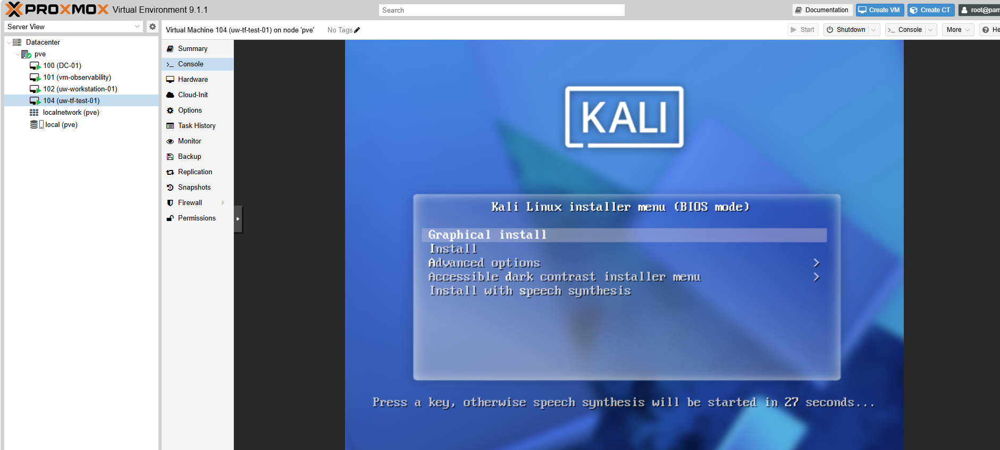
*Success — VM 104 now boots into the Kali Linux installer menu, confirming the Terraform-provisioned VM and its attached ISO are working end-to-end.*

---

## 5. File Server: NTFS & Share Permissions (Domain-Integrated)

Loosely following a standard AD file-server lab (adapted with my own group/folder names instead of the generic HR/IT/Finance/Public example): stand up a shared data folder on the domain controller, control access through AD security groups rather than individual users, and verify effective permissions from a separate domain-joined client.

**Concept:** access to a network share is gated by two layers — **share permissions** (checked first, when connecting over the network) and **NTFS permissions** (checked second, on the files/folders themselves). Where they overlap, the more restrictive of the two wins. So the real access control lives in NTFS permissions tied to AD security groups; share permissions are generally left wide open (`Everyone` → Full Control) and NTFS does the actual gatekeeping.

### Step 1 — Create the shared folder structure

On `UW-DC01`, created `C:\Shares` with department subfolders. Rather than the generic `HR / IT / Finance / Public` example, I used names that matched my existing OU/group structure: `CAS-Deanery`, `CAS-IT`, and `Finance`.

### Step 2 — Create AD security groups

In `dsa.msc`, created a security group for each folder (`CAS-Deanery`, `CAS-IT`, `Finance`) so permissions get assigned to groups, not individual accounts — group membership becomes the single source of truth for access, and adding/removing a user's access is just an AD group membership change instead of editing NTFS ACLs directly.

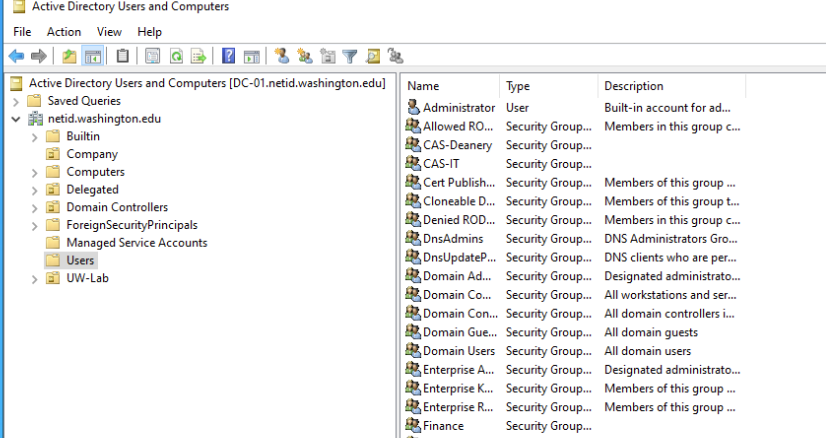
*The three security groups (`CAS-Deanery`, `CAS-IT`, `Finance`) created in AD, one per shared folder.*

### Step 3 — Create a test user and assign group membership

Instead of creating three separate named users (one per department, as the reference lab suggests), I created a single generic `test test` account and used it to validate one folder's permission chain end-to-end.

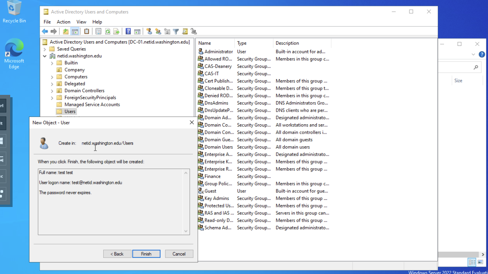
*Creating the `test test` account used to validate the `CAS-IT` share.*

`test test` was then added to the `CAS-IT` group via the user's **Member Of** tab:

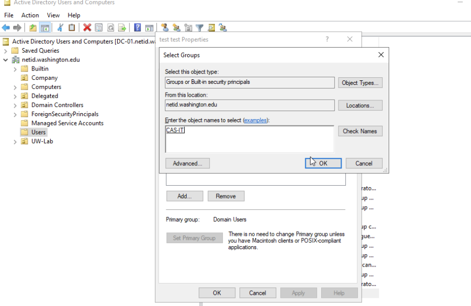
*Adding `test test` to the `CAS-IT` security group — this group membership is what will actually grant folder access.*

### Step 4 — Lock down NTFS permissions on the folder

For the `CAS-IT` folder specifically:

1. **Properties → Security → Advanced** to open Advanced Security Settings.
2. Since the folder was inheriting broad permissions from its parent (including a `Users (NETID\Users)` entry giving all domain users Read & Execute), inheritance had to be broken before those default entries could be edited.
3. Clicked **Disable inheritance**, then chose **Convert inherited permissions into explicit permissions on this object** — this preserves the existing entries as a starting point (rather than wiping them) so nothing gets locked out, including admin access.

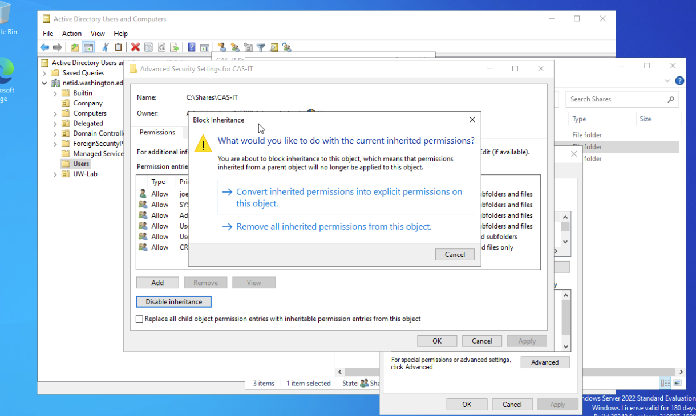
*Converting inherited permissions to explicit ones on `CAS-IT` — required before the broad `Users` entry can be safely edited or removed.*

4. With the permissions now explicit and editable, the general `Users (NETID\Users)` entries were removed, leaving only the `CAS-IT` group, `SYSTEM`, `Administrators`, and `CREATOR OWNER` — i.e., only the intended group (plus the accounts Windows needs for admin/system access) can reach the folder.

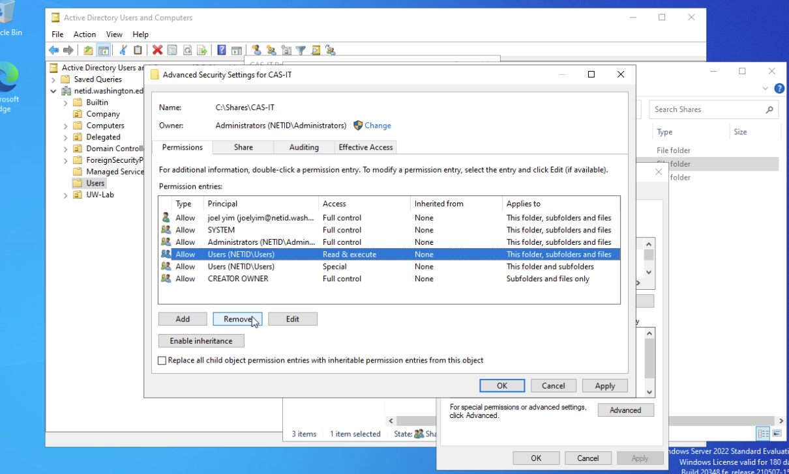
*Removing the general `Users` group from `CAS-IT`'s permission list — access is now scoped to the `CAS-IT` security group only.*

### Step 5 — Share the parent folder

`C:\Shares` was shared at the network level (Sharing tab → Advanced Sharing), with share-level permissions left permissive (`Everyone` → Full Control) since NTFS is doing the real access control per-subfolder — this is the standard pattern described above (share permissions as a loose outer gate, NTFS as the actual lock).

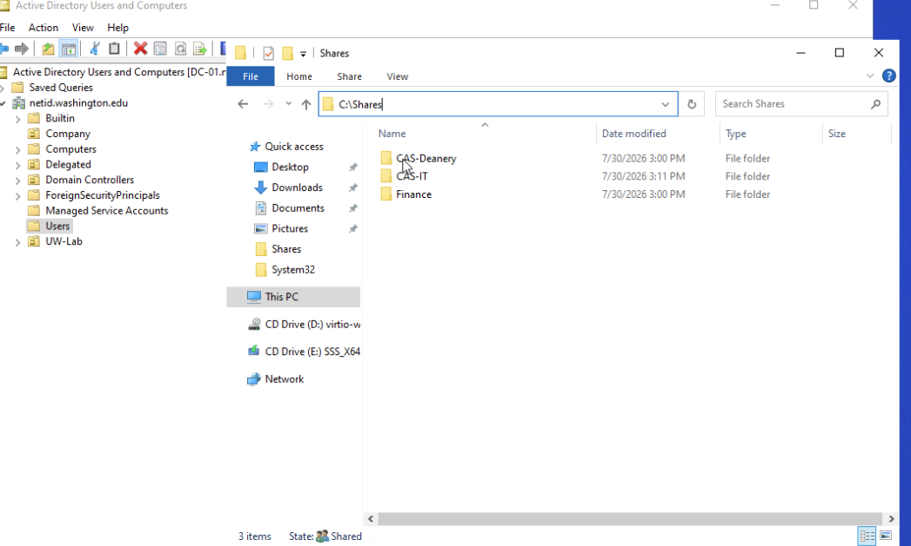
*The shared `C:\Shares` folder on `DC-01`, containing `CAS-Deanery`, `CAS-IT`, and `Finance`.*

### Step 6 — Verify from a separate domain-joined client

Logged into a different domain-joined workstation as `test test` and mapped the share (`\\DC-01\Shares`) as a network drive. Since `test test` is a member of `CAS-IT`, the folder is visible and accessible — confirming the whole chain (AD group membership → explicit NTFS ACL → share) is working end-to-end.

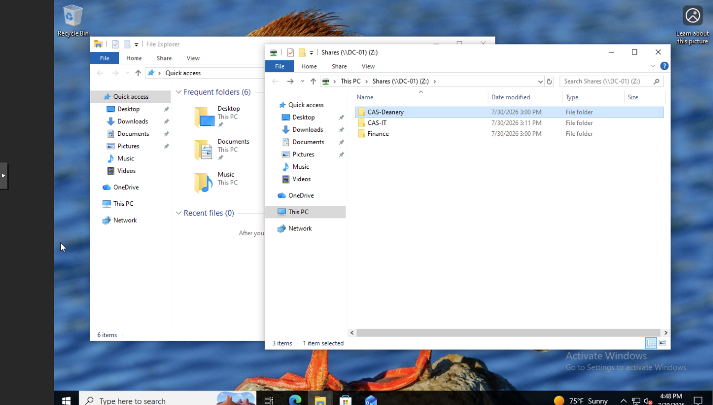
*Successfully mapped `\\DC-01\Shares` as a network drive from a different domain-joined PC, logged in as `test test` — confirms group-based NTFS permissions are enforced correctly over the network.*

---

## Notes / Not Yet Placed

A screenshot of a Qualtrics survey/directory dashboard was included in the first batch but doesn't correspond to anything in this homelab (Proxmox/AD/Terraform) writeup, so it was left out. Let me know if it belongs to a different project.

All 17 screenshots from the second batch were placed above — into the GPO/logon-banner walkthrough (Step 5) and a new "Git init → API token → `terraform apply` → first boot" walkthrough under the Proxmox + Terraform section, including the `boot failed: not a bootable disk` moment and how it was resolved.

More screenshots can still come in a follow-up batch — send them over and I'll slot them into the matching section above.
